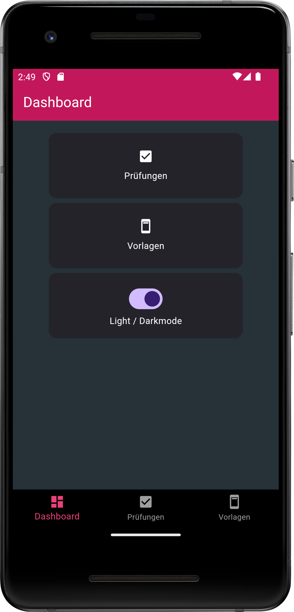
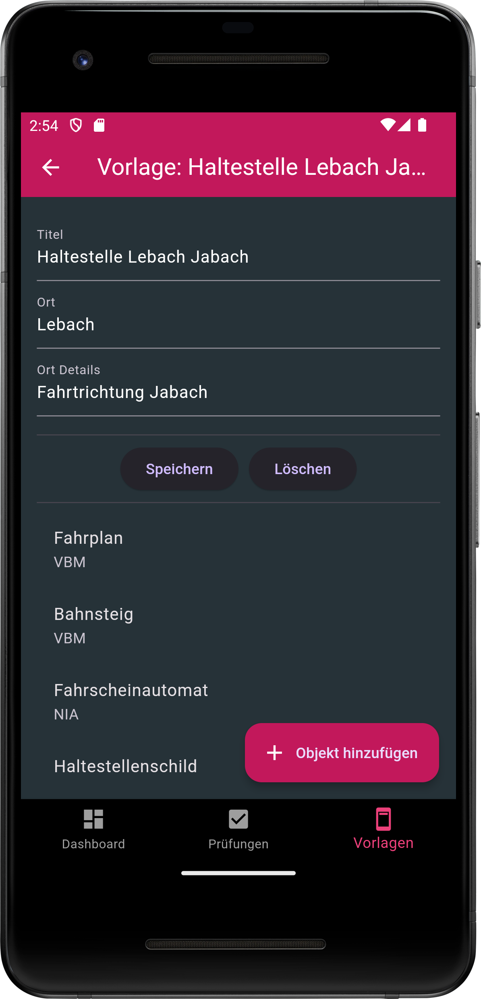
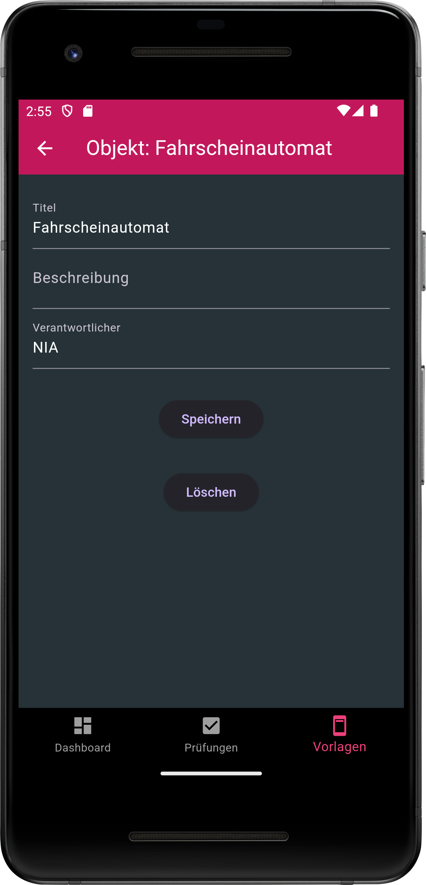
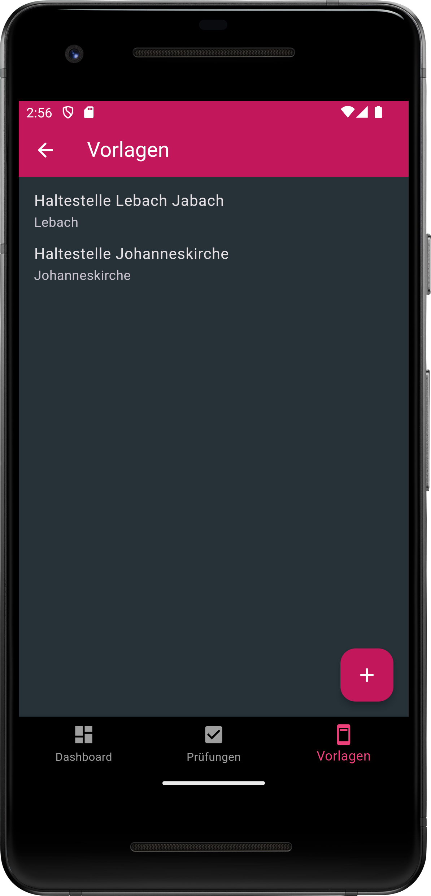
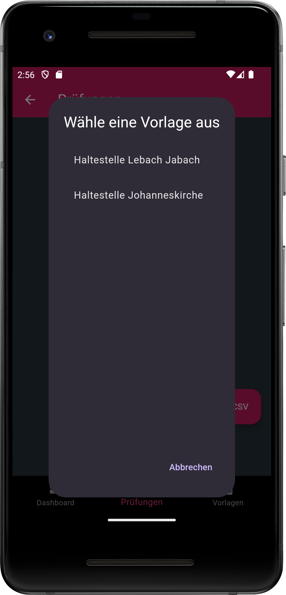
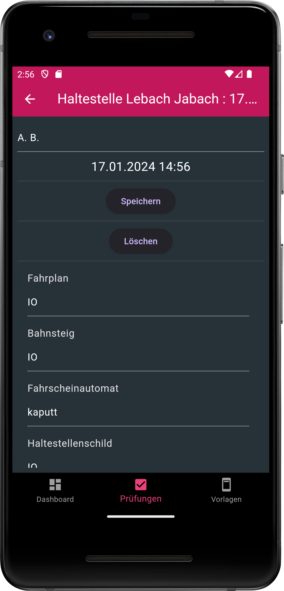
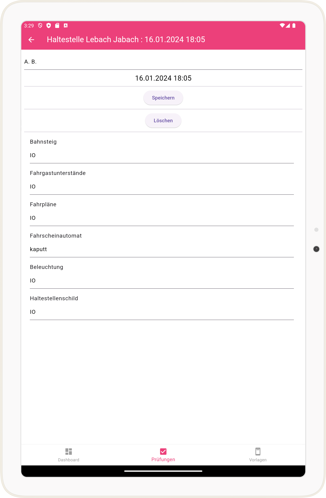
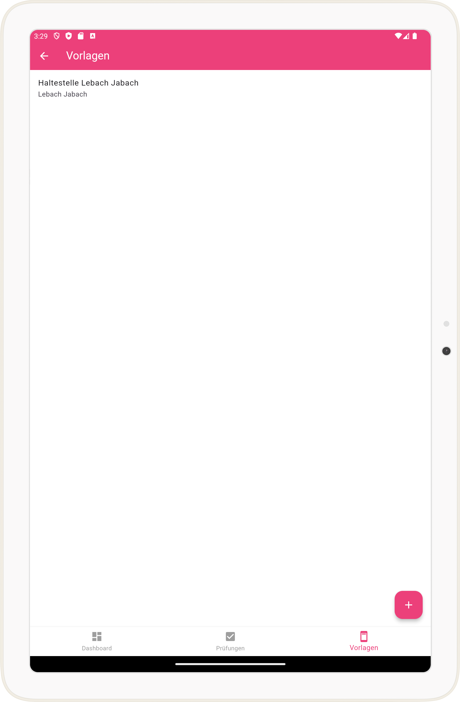

# Checkapp project

Die Check-App, gebaut mit Flutter, soll zur Überprüfung von Gegenständen in ihrem jeweiligen Ort helfen.

## Beschreibung

Das Projekt befindet sich noch in Bearbeitung. Die Hauptfunktionen sind jedoch einsatzbereit:

* Eingabe eines Vorlageformulars mit Titel, Ort, Ort Details
* Eingabe von Objekten in das Vorlageformular mit Titel, Beschreibung und Verantwortlichen
* Nach Auswahl der entsprechenden Vorlage und Eingabe des Prüfers kann der Zustand die jeweiligen Objekte angepasst werden
* Alle Prüfungen können als CSV für weitere Analysen (mit Excel usw.) exportiert werden. Die CSV beinhaltet alle Informationen.

Verbesserungen und Tests folgen.

## Screenshots

