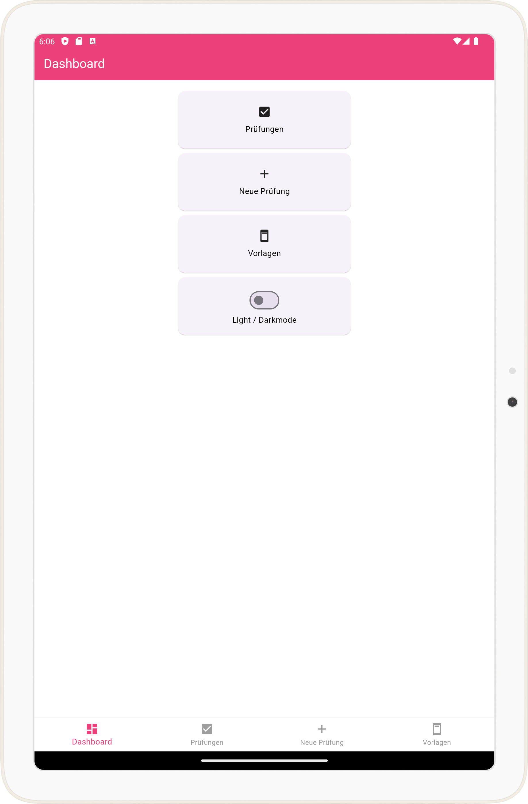
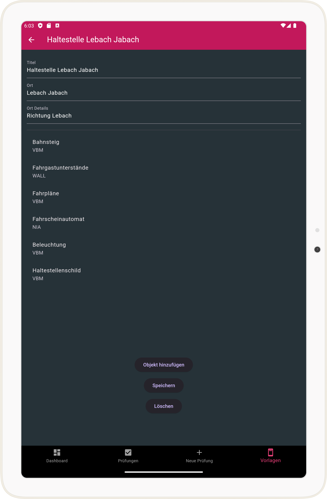
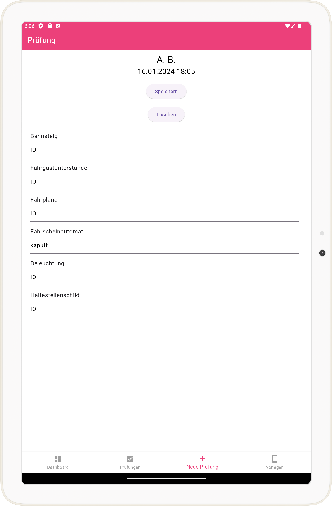

# checkapp

## Checkapp project

Die Check-App, gebaut mit Flutter, soll zur Überprüfung von Gegenständen in ihrem jeweiligen Ort helfen.

Das Projekt befindet sich noch in Bearbeitung. Die Hauptfunktionen sind jedoch funktionsbereit. Verbesserungen und Tests folgen.

